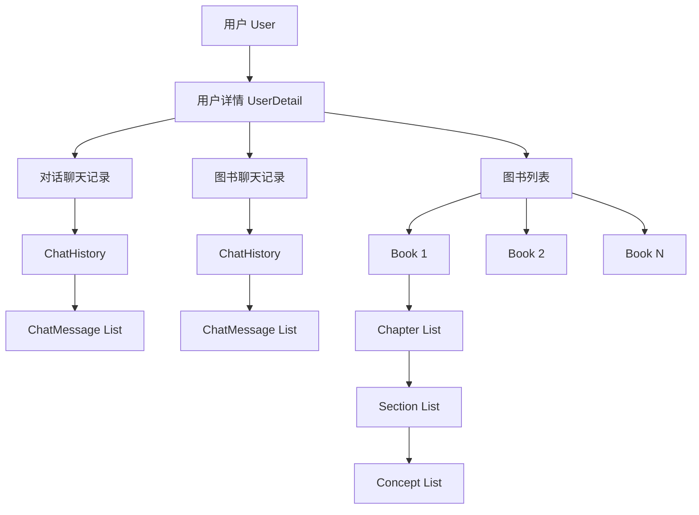

# Refbook 后端数据库结构指南

> 📖 **面向新接手开发者的数据库架构文档**  
> 本文档详细介绍了 Refbook 后端项目中 `module/database` 模块的数据结构设计与操作方法。

## 🏗️ 整体架构概览

Refbook 采用基于 [TinyDB](https://tinydb.readthedocs.io/) 的轻量级 JSON 文件数据库方案，所有数据以 JSON 格式存储在 `database_file/` 目录下。项目采用模块化设计，每个数据实体都有独立的模块文件。

### 📁 文件结构
```
module/database/
├── general.py          # 数据库连接与配置
├── user.py             # 用户基础信息
├── user_detail.py      # 用户详细信息
├── book.py             # 图书内容结构
└── chat_history.py     # 聊天记录管理
```

### 🗃️ 数据库文件
```
database_file/
├── db_user_v1.json          # 用户基础数据
├── db_user_detail_v1.json   # 用户详细数据
├── db_book_v1.json          # 图书内容数据
└── db_chat_history_v1.json  # 聊天记录数据
```

---

## 📋 数据模型详解

### 1. 👤 用户模型 (User)

**文件位置**: `module/database/user.py`

#### 📊 数据结构
```python
class User(BaseModel):
    id: str                    # 用户唯一标识符
    username: str              # 用户名（登录名）
    password_hash: str         # 密码哈希值
    user_detail_id: str        # 关联的用户详情ID
```

#### 🔧 主要操作方法
- `new_user(username, password_hash)` - 创建新用户
- `get_user_by_id(user_id)` - 通过ID获取用户
- `get_user_by_username(username)` - 通过用户名获取用户
- `delete_user_by_id(user_id)` - 删除用户（级联删除）

#### 💡 设计要点
- **安全性**: 密码采用哈希存储，不保存明文
- **关联性**: 每个用户都有对应的详细信息记录
- **唯一性**: 用户ID通过时间戳+UUID+盐值生成，确保全局唯一

---

### 2. 📝 用户详情模型 (UserDetail)

**文件位置**: `module/database/user_detail.py`

#### 📊 数据结构
```python
class UserDetail(BaseModel):
    id: str                              # 用户详情唯一标识符
    conversation_chat_history_id: str    # 与AI对话的聊天记录ID
    book_chat_history_id: str           # 图书生成相关的聊天记录ID
    book_ids: List[str]                 # 用户拥有的图书ID列表
```

#### 🔧 主要操作方法
- `new_user_detail()` - 创建新用户详情
- `get_user_detail(user_detail_id)` - 获取用户详情
- `add_book_to_user_detail(user_detail_id, book_id)` - 添加图书到用户
- `delete_book_from_user_detail(user_detail_id, book_id)` - 从用户移除图书
- `delete_user_detail_by_id(user_detail_id)` - 删除用户详情（级联删除）

#### 💡 设计要点
- **业务分离**: 将聊天记录按用途分为对话型和图书生成型
- **级联管理**: 删除用户详情时自动清理关联的聊天记录和图书
- **扩展性**: 预留了用户画像字段，便于后续功能扩展

---

### 3. 📚 图书模型 (Book)

**文件位置**: `module/database/book.py`

#### 📊 数据结构
```python
class Concept(BaseModel):
    introduction: str    # 知识点介绍
    explanation: str     # 知识点详细解释
    conclusion: str      # 知识点总结

class Section(BaseModel):
    title: str                    # 小节标题
    introduction: str             # 小节介绍
    concepts: List[Concept]       # 知识点列表

class Chapter(BaseModel):
    title: str                    # 章节标题
    introduction: str             # 章节介绍
    sections: List[Section]       # 小节列表

class Book(BaseModel):
    id: str                       # 图书唯一标识符
    title: str                    # 图书标题
    chapters: List[Chapter]       # 章节列表
```

#### 🔧 主要操作方法
- `new_book(book)` - 创建新图书
- `get_book(book_id)` - 获取图书内容
- `delete_book(book_id)` - 删除图书

#### 💡 设计要点
- **层次结构**: 图书 → 章节 → 小节 → 知识点，清晰的内容组织
- **完整性**: 每个层级都有标题和介绍，便于内容理解
- **AI友好**: 结构化设计便于AI生成和处理教学内容

---

### 4. 💬 聊天记录模型 (ChatHistory)

**文件位置**: `module/database/chat_history.py`

#### 📊 数据结构
```python
class ChatMessage(BaseModel):
    id: str                           # 消息唯一标识符
    role: Literal["human", "bot"]     # 消息角色：用户或机器人
    content: str                      # 消息内容

class ChatHistory(BaseModel):
    id: str                           # 聊天记录唯一标识符
    messages: List[ChatMessage]       # 消息列表
```

#### 🔧 主要操作方法
- `new_chat_history()` - 创建新聊天记录
- `get_chat_history(chat_history_id)` - 获取聊天记录
- `new_chat_message(chat_history_id, role, content)` - 添加新消息
- `get_chat_message_by_id(chat_history_id, message_id)` - 获取指定消息
- `get_chat_message_by_index(chat_history_id, index)` - 按索引获取消息
- `delete_chat_history(chat_history_id)` - 删除聊天记录
- `delete_chat_message(chat_history_id, message_id)` - 删除指定消息

#### 💡 设计要点
- **对话连续性**: 保持完整的对话上下文
- **角色区分**: 明确区分用户和AI的消息
- **灵活访问**: 支持按ID和索引两种方式访问消息

---

## 🔗 数据关系图



---

## ⚙️ 技术实现细节

### 🔒 并发安全
所有数据库操作都使用 `asyncio.Lock()` 确保线程安全：
```python
_operation_lock = asyncio.Lock()

async def operation():
    async with _operation_lock:
        # 数据库操作
        pass
```

### 🆔 ID生成策略
采用多重保证的唯一ID生成方案：
```python
def _get_current_id(sign: int) -> str:
    timestamp = int(time.time() * 1000000)  # 微秒级时间戳
    unique_id = str(uuid.uuid4())           # UUID4随机值
    # 使用SHA256哈希确保固定长度和安全性
    return hashlib.sha256(f"salt_{timestamp}_{unique_id}_{sign}_module".encode()).hexdigest()
```

### 🛡️ 错误处理
统一的错误返回格式：
```python
# 成功返回
{"type": "success", "message": "具体数据或成功信息"}

# 错误返回
{"type": "error", "message": "错误描述"}
```

### 🗃️ 数据库配置
通过 `general.py` 统一管理数据库连接：
```python
# TinyDB 配置
tinydb.TinyDB(path, indent=4, ensure_ascii=False, encoding='utf-8')
```

---

## 🚀 快速上手指南

### 1. 创建新用户流程
```python
# 1. 创建用户
user_id = await new_user("username", "password_hash")

# 2. 系统自动创建：
#    - UserDetail 记录
#    - 两个 ChatHistory 记录（对话和图书）
#    - 空的图书列表
```

### 2. 图书管理流程
```python
# 1. 创建图书结构
book = Book(title="示例图书", chapters=[...])

# 2. 保存图书
book_id = await new_book(book)

# 3. 关联到用户
await add_book_to_user_detail(user_detail_id, book_id)
```

### 3. 聊天记录管理
```python
# 1. 创建聊天记录
result = await new_chat_history()
chat_id = result["message"]

# 2. 添加消息
await new_chat_message(chat_id, "human", "用户消息")
await new_chat_message(chat_id, "bot", "AI回复")
```

---

## ⚠️ 重要注意事项

### 🔄 级联删除
- 删除用户会级联删除用户详情、关联图书和聊天记录
- 删除用户详情会级联删除关联的图书和聊天记录
- 从用户详情删除图书会物理删除图书文件

### 🔐 数据一致性
- 所有ID字段不可为空
- 用户名和密码哈希必须有效
- 图书只属于创建它的用户

### 🛠️ 开发建议
1. **总是检查返回值类型** - 区分成功返回的数据和错误信息
2. **使用异步操作** - 所有数据库操作都是异步的
3. **合理处理异常** - 网络和文件IO可能失败
4. **遵循数据模型** - 使用Pydantic模型确保数据格式正确

---

## 🎯 常见开发场景

### 用户注册登录
```python
# 注册
user_id = await new_user(username, hashed_password)
if isinstance(user_id, dict):
    # 处理错误
    print(user_id["message"])

# 登录验证
user = await get_user_by_username(username)
if isinstance(user, User):
    # 验证密码哈希
    # 生成JWT token
```

### AI对话管理
```python
# 获取用户的对话历史
user_detail = await get_user_detail(user_detail_id)
chat_history = await get_chat_history(user_detail.conversation_chat_history_id)

# 添加用户消息
await new_chat_message(chat_history.id, "human", user_input)

# 添加AI回复
await new_chat_message(chat_history.id, "bot", ai_response)
```

### 图书内容生成
```python
# 创建图书结构
book = Book(
    title="Python入门教程",
    chapters=[
        Chapter(
            title="第一章：基础语法",
            introduction="介绍Python基础语法",
            sections=[
                Section(
                    title="变量和数据类型",
                    introduction="学习Python的变量声明和数据类型",
                    concepts=[
                        Concept(
                            introduction="变量是程序中的数据容器",
                            explanation="详细解释变量的概念和使用方法",
                            conclusion="掌握变量使用是编程的基础"
                        )
                    ]
                )
            ]
        )
    ]
)

# 保存并关联到用户
book_id = await new_book(book)
await add_book_to_user_detail(user_detail_id, book_id)
```

---

**📚 Happy Coding! 如有疑问，请参考各模块的详细注释或联系开发团队。**

---
*最后更新: 2025年8月2日*  
*文档版本: v1.0*
